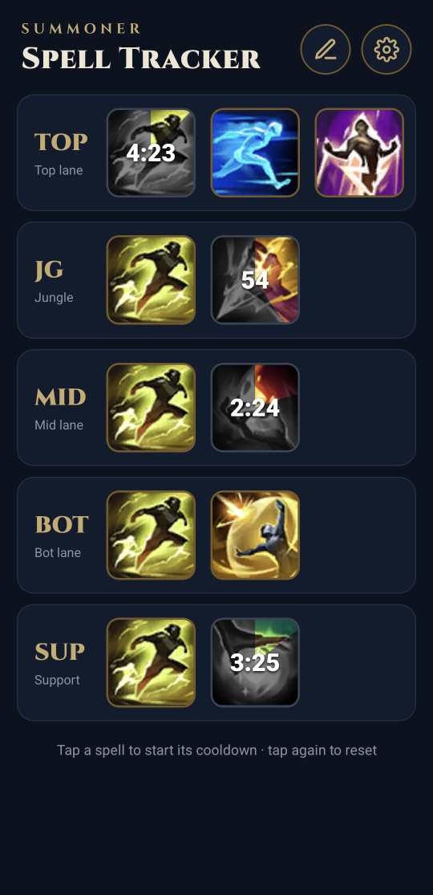
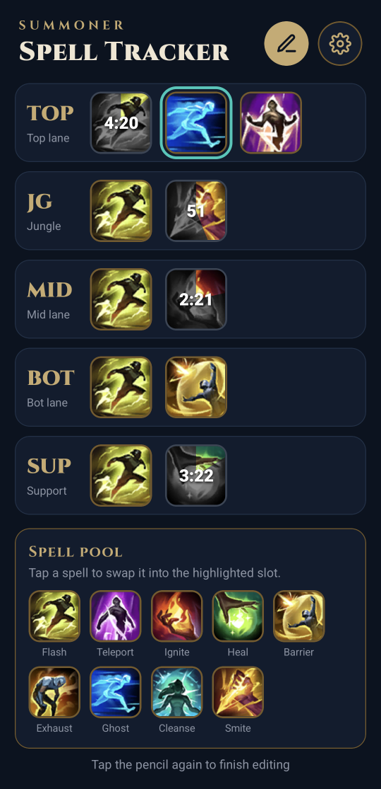
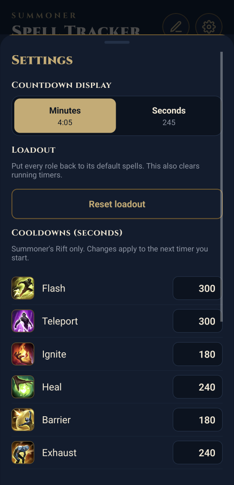

# Summoner Spell Tracker

Track enemy summoner spell cooldowns in League of Legends on your phone. Tap a spell when the enemy uses it and a countdown starts; the icon greys out and its colour sweeps back like a clock until it's ready again.

**Summoner's Rift only.** Android for now.

<p align="center">
  
  
  
</p>

## Install on Android

1. On your phone, open the [latest release](https://github.com/NightPixel24/Summoner-Spell-Tracker/releases/latest) and download the `.apk` file.
2. Open the downloaded file. Android will ask you to allow installs from your browser or file manager the first time; allow it for that app.
3. Tap **Install**. If Google Play Protect warns that it doesn't recognise the app, choose **Install anyway**. It warns about any app that isn't from the Play Store.

To update, download the newer APK from the releases page and install it over the old one. Your loadout and settings are kept.

The app works fully offline and doesn't use the internet at all. The only permission it asks for is vibration.

## How to use

| Action | What it does |
|---|---|
| **Tap** a spell | Starts its cooldown. Tap it again to reset it (for mis-taps). |
| **Hold** a Teleport tile | Switches it to Unleashed Teleport (after 10:00), and back. |
| **Pencil** | Edit mode: tap a slot, then a spell from the pool to swap it in (Unleashed Teleport is the last one). The selection moves down the column automatically, so you can set a whole loadout in a few taps. |
| **Cog** | Settings: countdown in minutes (`4:05`) or seconds (`245`), reset your loadout, and change any spell's cooldown. |

- **TOP has a third slot** for the extra spell the top lane quest can give.
- **Timers keep counting** if you lock your phone or close the app, and the screen stays on while any timer is running.
- Your phone **vibrates** when you tap a spell and when a spell comes back up.

## Default cooldowns

Checked against patch 16.18.1. Every value can be changed in Settings.

| Spell | Cooldown | | Spell | Cooldown |
|---|---|---|---|---|
| Flash | 300s | | Exhaust | 240s |
| Teleport | 300s | | Ghost | 240s |
| Unleashed Teleport | 330s | | Cleanse | 240s |
| Ignite | 180s | | Smite | 90s |
| Heal | 240s | | Barrier | 180s |

- **Unleashed Teleport** drops from 330s at level 1 to 240s at level 18; set it to match the game if you like.
- **Smite** has two charges. The 90s is how long one charge takes to come back.

Default loadout: Flash plus TOP Ghost and Unleashed Teleport, JG Smite, MID Ignite, BOT Barrier, SUP Heal.

## Building from source

Built with [Expo](https://expo.dev) (React Native) and TypeScript.

```bash
npm install
npx expo start        # then open it in Expo Go on your phone, or press w for web
npm test              # Jest test suite
npx tsc --noEmit      # typecheck
```

Build an installable APK with [EAS Build](https://docs.expo.dev/build/introduction/) (needs a free Expo account):

```bash
npx eas-cli build --platform android --profile preview
```

Other scripts:

- `node scripts/fetch-spell-icons.mjs` downloads the spell icons for the latest patch and prints Riot's current cooldowns.
- `node scripts/make-app-icons.mjs` redraws the app icon and splash image.

Project layout: `App.tsx` (the screen), `components/` (tiles, rows, spell pool, settings), `state/` (reducer and saving), `data/spells.ts` (spells, cooldowns, default loadout), `__tests__/`.

## License and credits

The code is released under the [MIT License](LICENSE).

Spell icons are © Riot Games, from [Data Dragon](https://developer.riotgames.com/docs/lol#data-dragon) and [CommunityDragon](https://www.communitydragon.org/), and are not covered by the MIT License.

Summoner Spell Tracker isn't endorsed by Riot Games and doesn't reflect the views or opinions of Riot Games or anyone officially involved in producing or managing Riot Games properties. Riot Games, and all associated properties are trademarks or registered trademarks of Riot Games, Inc.
